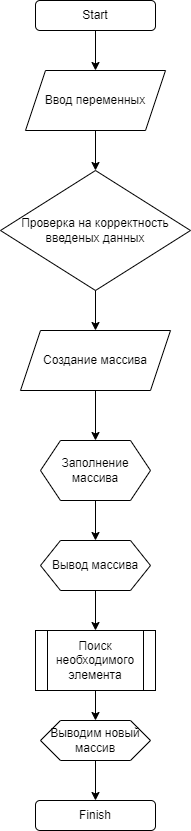

# Итоговая проверочная работа

## Задание

[Здесь можно увидеть задание](https://gbcdn.mrgcdn.ru/uploads/asset/3699309/attachment/7ddba9ad1f1c3d9b9f681c5fe93ee91f.png)

1. Создал репозиторий на gitHub
2. Создал папку Task, в которой была прописана команда **dotnet new console**
3. Далее была написана сама программа
+ сперва задается размер массива
+ после чего идет проверка, что была введена именно цифра
+ создаем сам массив
+ заполняем его
+ выводим созданный массив
+ после чего я использовал функцию, для поиска элемента размером 3 или меньше
+ и в конце я вывожу получившийся массив с икомыми элементами
4. После чего сделал **_блок-схему_** получившейся программы

5. Заполнил файл readme.md